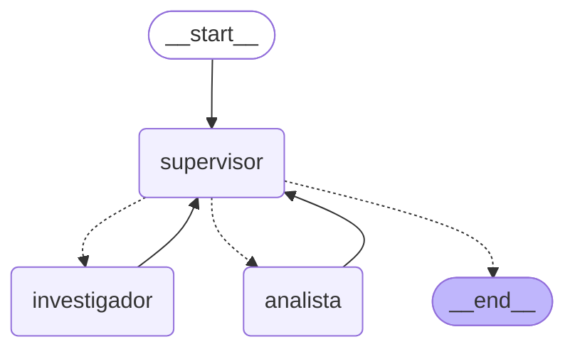

# Orquestador Multi-Agente de Análisis e Investigación

Sistema jerárquico construido con **LangGraph**: un nodo **Supervisor**
decide dinámicamente a qué agente especialista delegar cada parte de
una tarea — un **Agente de Investigación** (recolecta información) y un
**Agente de Análisis** (la procesa) — hasta que la tarea está completa.

**Módulo 6, Pre-entrega 6** - Programa de AI Engineering @ CodeHouse

---

## 🎯 Topología elegida: Jerárquica (Supervisor-Especialistas)

Elegí esta topología, en vez de una topología en cadena fija (pipeline
lineal) o una completamente descentralizada (los agentes se comunican
entre sí sin un router central), por dos motivos:

1. **Extensibilidad**: agregar un tercer especialista (por ejemplo, un
   Agente de Reportes) solo requiere sumarlo al mapa de rutas del
   Supervisor — no hay que rediseñar el flujo de comunicación entre
   agentes existentes.
2. **Punto único de control**: el Supervisor es el único lugar donde
   vive la lógica de "¿ya terminamos?" y "¿a quién le toca ahora?". Esto
   hace que el criterio de suficiencia y el corte de seguridad contra
   loops sean fáciles de auditar y de testear de forma aislada (ver
   `tests/test_graph.py`), en vez de estar repartidos en cada agente.

## 📊 Diagrama del grafo

Generado directamente con `grafo.get_graph().draw_mermaid()` sobre el
grafo real y compilado (no es un diagrama dibujado a mano):



Para regenerarlo vos mismo en cualquier momento (por ejemplo, si le
agregás un nodo nuevo al grafo):

```bash
python -c "from graph import build_graph; print(build_graph().get_graph().draw_mermaid())"
```

---

## 📋 Estructura del Proyecto

```
entregable_6_orquestador/
├── state.py                  # Esquema de estado compartido (OrquestadorState)
├── supervisor.py               # Nodo Supervisor: decisión estructurada + salvaguardas
├── graph.py                      # Grafo principal: nodos + aristas condicionales
├── agents/
│   ├── research_agent.py           # Agente de Investigación (herramienta de búsqueda simulada)
│   └── analyst_agent.py              # Agente de Análisis (sentimiento + estadísticas)
├── tests/                              # Tests con LLM falso (sin necesitar LLM real)
│   ├── test_tools.py
│   ├── test_graph.py
│   ├── test_supervisor.py
│   └── test_end_to_end.py
├── traces/                                # Trazas de ejecución (.json)
├── demo_flujo.ipynb                         # Notebook de demostración del flujo
├── main.py                                    # Script de demo (equivalente al notebook)
├── requirements.txt
├── .env.example
└── README.md
```

---

## 🏗️ Cómo está armado

### 1. `state.py` — Estado compartido estructurado

```python
class OrquestadorState(MessagesState):
    next_agent: Literal["investigador", "analista", "FINISH"]
    instruccion_para_agente: str
    contribuciones: Dict[str, str]
    pasos: int
```

- `contribuciones` rastrea explícitamente qué aportó cada agente — así
  nunca se pierde de vista quién dijo qué, ni el Supervisor tiene que
  releer todo el historial de mensajes para saber qué falta.
- `instruccion_para_agente` y `pasos` existen específicamente para
  mitigar los dos "Errores Comunes a Evitar" de la consigna (ver más abajo).

### 2. Los agentes especialistas (`agents/`)

Cada uno es un sub-agente **ReAct completo**, creado con
`create_react_agent` de LangGraph, con herramientas acotadas a su rol:

- **`research_agent.py`**: herramienta `buscar_comentarios(tema)` — una
  búsqueda **simulada** sobre una base de datos ficticia en memoria de
  comentarios de usuarios (alternativa a Tavily habilitada por la
  consigna, elegida para mantener el prototipo autocontenido y
  testeable sin depender de una API externa).
- **`analyst_agent.py`**: herramientas `analizar_sentimiento(comentarios)`
  (clasificación por palabras clave, determinística) y
  `calcular_estadisticas(numeros)` (promedio, mínimo, máximo).

Cada agente tiene una única responsabilidad y su prompt se lo recuerda
explícitamente (el investigador nunca analiza, el analista nunca sale a
buscar datos) — esto le da al Supervisor un mapa de ruteo sin ambigüedad.

### 3. `supervisor.py` — El cerebro del orquestador

Usa **salida estructurada** (`llm.with_structured_output()`, mismo
patrón que en el Entregable 2) para decidir, en cada vuelta:

```python
class DecisionSupervisor(BaseModel):
    next_agent: Literal["investigador", "analista", "FINISH"]
    instruccion: str
    razon: str
```

El campo `Literal` mapea directamente a los nombres de los nodos del
grafo, tal como pide la consigna.

**Robustez y validación.** Probando el sistema con un modelo local chico
(`llama3.2` en Ollama) apareció un problema real: a veces
`with_structured_output()` no devuelve ninguna decisión (devuelve
`None`) y el grafo se rompía. Por eso el Supervisor tiene tres capas,
todas testeadas:

1. **Reintento**: si el LLM no da una decisión válida, se le vuelve a
   pedir (`INTENTOS_DECISION`).
2. **Plan B por reglas**: si igual falla, la decisión se toma de forma
   determinística (¿qué especialista requerido todavía no contribuyó?)
   en vez de romper el flujo.
3. **Rúbrica de validación en código** (`_validar_decision`), que aplica
   sin importar qué haya decidido el LLM:
   - no se puede cerrar (`FINISH`) ni saltear el orden
     investigador → analista hasta que los especialistas requeridos
     hayan contribuido;
   - al analista siempre se le entregan los datos que recolectó el
     investigador;
   - una delegación nunca puede llevar una instrucción vacía.

Esta rúbrica es el criterio de "Validación" que pide la consigna: el
Supervisor valida los resultados de los especialistas antes de dar el
`END`. La contracara, dicho con honestidad: en este prototipo el orden
de los especialistas queda fijo por la rúbrica; el LLM decide sobre todo
la redacción de la instrucción y cuándo refinar una vez que ambos
aportaron.

### 4. `graph.py` — El grafo

```python
builder.add_conditional_edges(
    "supervisor",
    _enrutar,
    {"investigador": "investigador", "analista": "analista", END: END},
)
builder.add_edge("investigador", "supervisor")
builder.add_edge("analista", "supervisor")
```

Cada especialista, al terminar, siempre vuelve al Supervisor — nunca se
comunican entre sí directamente. Esto es intencional: mantiene toda la
lógica de decisión centralizada y auditable en un solo lugar.

---

## ⚠️ Cómo se manejan los "Errores Comunes a Evitar"

### El "Supervisor Infinito"

Dos salvaguardas, no una sola:

1. **Criterio de Suficiencia explícito en el prompt**: el Supervisor
   tiene instrucciones estrictas de delegar *solo* si falta información
   concreta, nunca por perfeccionismo.
2. **Corte de seguridad "duro"** (`MAX_PASOS`, default 6): un contador
   de pasos que fuerza el cierre después de un máximo de vueltas, sin
   importar qué decida el LLM. Se probó explícitamente en
   `tests/test_graph.py::test_corte_de_seguridad_contra_supervisor_infinito`,
   simulando un Supervisor que nunca decide terminar por su cuenta — el
   grafo igual corta correctamente.

### Contaminación de Contexto

Cada especialista se invoca con **solo la instrucción puntual** que le
da el Supervisor (`state["instruccion_para_agente"]`), nunca con el
historial completo de mensajes del sistema:

```python
def _nodo_investigador(state):
    agente = crear_agente_investigador(llm)
    instruccion = state["instruccion_para_agente"]  # NO todo el historial
    resultado = agente.invoke({"messages": [HumanMessage(content=instruccion)]})
    ...
```

Esto se verifica explícitamente en
`tests/test_graph.py::test_flujo_completo_investigador_luego_analista`,
donde el nodo falso del investigador confirma que recibe la instrucción
puntual y no el estado completo del sistema.

---

## 🚀 Instalación y uso

### 1. Dependencias

```bash
cd entregable_6_orquestador
python -m venv venv
venv\Scripts\activate      # Windows. Mac/Linux: source venv/bin/activate
pip install -r requirements.txt
```

### 2. Ollama (LLM 100% gratis y local, default)

```bash
ollama pull llama3.2
```

Si preferís Claude o GPT-4o, copiá `.env.example` a `.env` y cambiá
`GENERATION_PROVIDER`.

### 3. Correr la demo

```bash
python main.py
```

o, para la versión notebook (paso a paso, con el diagrama incluido):

```bash
jupyter notebook demo_flujo.ipynb
```

Ambos corren la misma consulta de ejemplo — una que obliga al Supervisor
a delegar primero al Investigador y después al Analista — e imprimen la
traza completa de la delegación. `main.py` además guarda esa traza en
`traces/trace_demo_delegacion.json`.

---

## 🧪 Tests automatizados (sin necesitar ningún LLM real)

```bash
pytest -v
```

- **`test_tools.py`**: prueba las herramientas de ambos agentes
  directamente (lógica pura).
- **`test_graph.py`**: prueba la **mecánica del grafo** con nodos
  falsos en lugar del LLM real — el enrutamiento
  investigador→analista→FINISH, el corte de seguridad contra el
  Supervisor Infinito, y que `build_graph()` real tiene la estructura
  esperada.
- **`test_supervisor.py`**: prueba el Supervisor con un LLM falso,
  incluyendo el fallo real observado (decisión `None`), el reintento,
  el plan B por reglas y la rúbrica de validación.
- **`test_end_to_end.py`**: corre el **grafo real completo** (Supervisor
  real + agentes `create_react_agent` reales + herramientas reales) con
  un chat model guionado que además fuerza el fallo del Supervisor, y
  verifica el orden exacto de la delegación en la traza.

---

## ✅ Checklist de la consigna

| Requisito | Dónde está |
|---|---|
| Topología jerárquica con nodo Supervisor | `supervisor.py` + `graph.py` |
| ≥2 agentes especialistas (Investigación + Análisis) | `agents/research_agent.py`, `agents/analyst_agent.py` |
| Estado compartido estructurado (hereda de MessagesState) | `state.py` → `OrquestadorState` |
| Rastreo de qué agente aportó qué | `state.py` → campo `contribuciones` |
| Supervisor decide completitud o refinamiento | `supervisor.py` → `DecisionSupervisor.next_agent` |
| `create_react_agent` para los especialistas | `agents/*.py` → `crear_agente_*()` |
| Herramientas acotadas por agente | `TOOLS_INVESTIGADOR`, `TOOLS_ANALISTA` |
| Prompt del Supervisor con criterio claro de ruteo | `supervisor.py` → `PROMPT_SUPERVISOR` |
| `Literal` mapeando a nombres de nodos | `state.py` → `NombreAgente`; `supervisor.py` → `DecisionSupervisor.next_agent` |
| `StateGraph` + `add_node` + Conditional Edges | `graph.py` → `build_graph()` |
| Validación de resultados antes del END (rúbrica) | `supervisor.py` → `_validar_decision()` + `PROMPT_SUPERVISOR` |
| Salvaguarda contra el "Supervisor Infinito" | `supervisor.py` → `MAX_PASOS` |
| Mitigación de "Contaminación de Contexto" | `graph.py` → `_nodo_investigador`/`_nodo_analista` (solo instrucción puntual) |
| README con diagrama Mermaid | Esta sección |
| Video corto o notebook del flujo de delegación | `demo_flujo.ipynb` |
| Repo sin API keys (usa `.env`) | Todos los módulos leen de `os.getenv()` |

---

**Listo para escalar a equipos de más de dos especialistas. 🚀**
